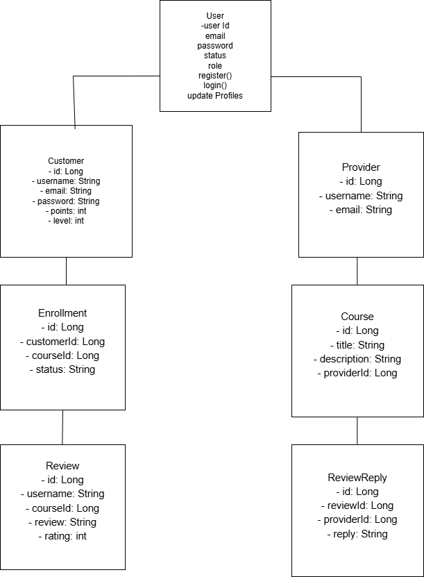

# lifeLvling - Backend API Documentation

**Version:** 1.0
**Last Updated:** March 24, 2026
**Base URL:** `http://localhost:8080/api`

---

## 1. API Endpoints
The LocalHarvest Hub Backend API provides a RESTful interface for managing: 

- **User Accounts**: Customer and Provider
- **Courses**: 
- **Enrollments**: Customer subsenrollments to courses 
- **Reviews**: Customer feedback on courses
- **Audit Logs**: Administrative tracking of system actions

---
## 2. UML Class Diagram

## 3. API Endpoints
---

The lifeLvling Backend API provides a RESTful interface for managing:

- Customers – User accounts and progression system  
- Providers – Users who create and manage the courses  
- Courses – Services offered by providers  
- Enrollments – Customer subscriptions to courses  
- Reviews – Customer feedback on courses  
- ReviewReplies – Provider responses to reviews  

---

## Customer Endpoints (Customer, Enrollment, Reviews)

---

### Create Customer

Endpoint: POST /customers  
Description: Create a new customer account.

Request:
POST /customers

Body:
{
  "username": "string",
  "email": "string",
  "password": "string",
  "points": 0,
  "level": 1
}

Status Code: 201 Created

---

### Get All Customers

Endpoint: GET /customers  
Description: Retrieve all customers.

Request:
GET /customers

Status Code: 200 OK

---

### Get Customer by ID

Endpoint: GET /customers/{id}  
Description: Retrieve a specific customer.

Request:
GET /customers/1

Status Code: 200 OK or 404 Not Found

---

### Update Customer

Endpoint: PUT /customers/{id}  
Description: Update an existing customer.

Request:
PUT /customers/1

Body:
{
  "username": "string",
  "email": "string",
  "password": "string",
  "points": 0,
  "level": 1
}

Status Code: 200 OK or 404 Not Found

---

### Delete Customer

Endpoint: DELETE /customers/{id}  
Description: Delete a customer.

Request:
DELETE /customers/1

Status Code: 204 No Content

---## Provider Endpoints

---

### Create Provider

Endpoint: POST /providers  
Description: Create a new provider.

Body:
{
  "username": "string",
  "email": "string"
}

Status Code: 201 Created

---

### Get All Providers

Endpoint: GET /providers  
Description: Retrieve all providers.

Status Code: 200 OK

---

### Get Provider by ID

Endpoint: GET /providers/{id}

Status Code: 200 OK or 404 Not Found

---

### Update Provider

Endpoint: PUT /providers/{id}

Status Code: 200 OK or 404 Not Found

---

### Delete Provider

Endpoint: DELETE /providers/{id}

Status Code: 204 No Content

## 3. Enrollment Endpoints

---

### Create Enrollment

Endpoint: POST /enrollments  
Description: Enroll a customer in a course.

Request:
POST /enrollments

Body:
{
  "customerId": 1,
  "courseId": 101,
  "status": "ACTIVE"
}

Status Code: 201 Created

---

### Get All Enrollments

Endpoint: GET /enrollments  
Description: Retrieve all enrollments.

Request:
GET /enrollments

Status Code: 200 OK

---

### Get Enrollment by ID

Endpoint: GET /enrollments/{id}  
Description: Retrieve a specific enrollment.

Request:
GET /enrollments/1

Status Code: 200 OK or 404 Not Found

---

### Update Enrollment

Endpoint: PUT /enrollments/{id}  
Description: Update enrollment status.

Request:
PUT /enrollments/1

Body:
{
  "customerId": 1,
  "courseId": 101,
  "status": "ACTIVE"
}

Status Code: 200 OK or 404 Not Found

---

### Delete Enrollment

Endpoint: DELETE /enrollments/{id}  
Description: Delete an enrollment.

Request:
DELETE /enrollments/1

Status Code: 204 No Content

---

## 4. Review Endpoints

---

### Create Review

Endpoint: POST /reviews  
Description: Submit a review for a course.

Request:
POST /reviews

Body:
{
  "username": "string",
  "courseId": 101,
  "review": "string",
  "rating": 3
}

Validation Rules:
- rating must be between 1 and 5

Status Code: 201 Created

---

### Get All Reviews

Endpoint: GET /reviews  
Description: Retrieve all reviews.

Request:
GET /reviews

Status Code: 200 OK

---

### Get Review by ID

Endpoint: GET /reviews/{id}  
Description: Retrieve a specific review.

Request:
GET /reviews/1

Status Code: 200 OK or 404 Not Found

---

### Get Reviews by Course

Endpoint: GET /reviews/course/{courseId}  
Description: Retrieve all reviews for a course.

Request:
GET /reviews/course/101

Status Code: 200 OK

---

### Get Reviews by Rating

Endpoint: GET /reviews/rating/{rating}  
Description: Retrieve reviews filtered by rating.

Request:
GET /reviews/rating/5

Status Code: 200 OK

---

### Update Review

Endpoint: PUT /reviews/{id}  
Description: Update an existing review.

Request:
PUT /reviews/1

Body:
{
  "username": "string",
  "courseId": 101,
  "review": "updated review text",
  "rating": 4
}

Status Code: 200 OK or 404 Not Found

---

### Delete Review

Endpoint: DELETE /reviews/{id}  
Description: Delete a review.

Request:
DELETE /reviews/1

Status Code: 204 No Content

---## Course Endpoints

- POST /courses
- GET /courses
- GET /courses/{id}
- PUT /courses/{id}
- DELETE /courses/{id}

---

## ReviewReply Endpoints

- POST /reviewReplies
- GET /reviewReplies
- GET /reviewReplies/{id}
- DELETE /reviewReplies/{id}

## 5. Example Workflow

1. Create a customer  
2. Enroll the customer in a course  
3. Submit a review  
4. Retrieve reviews by rating or course  

## 4. Use Case Mapping Table

| Use Case ID | Use Case Name                | Endpoint                          | Method | Description                                      |
|------------|------------------------------|-----------------------------------|--------|--------------------------------------------------|
| UC-CUST-001 | Create Customer              | /customers                        | POST   | Create a new customer account                    |
| UC-CUST-002 | Get All Customers            | /customers                        | GET    | Retrieve all customers                           |
| UC-CUST-003 | Get Customer by ID           | /customers/{id}                   | GET    | Retrieve a specific customer                     |
| UC-CUST-004 | Update Customer              | /customers/{id}                   | PUT    | Update customer information                      |
| UC-CUST-005 | Delete Customer              | /customers/{id}                   | DELETE | Remove a customer from the system                |

| UC-ENR-001 | Create Enrollment            | /enrollments                      | POST   | Enroll a customer in a course                    |
| UC-ENR-002 | Get All Enrollments          | /enrollments                      | GET    | Retrieve all enrollments                         |
| UC-ENR-003 | Get Enrollment by ID         | /enrollments/{id}                 | GET    | Retrieve a specific enrollment                   |
| UC-ENR-004 | Update Enrollment            | /enrollments/{id}                 | PUT    | Update enrollment status                         |
| UC-ENR-005 | Delete Enrollment            | /enrollments/{id}                 | DELETE | Remove an enrollment                             |

| UC-REV-001 | Create Review                | /reviews                          | POST   | Submit a review for a course                     |
| UC-REV-002 | Get All Reviews              | /reviews                          | GET    | Retrieve all reviews                             |
| UC-REV-003 | Get Review by ID             | /reviews/{id}                     | GET    | Retrieve a specific review                       |
| UC-REV-004 | Get Reviews by Course        | /reviews/course/{courseId}        | GET    | Retrieve reviews for a specific course           |
| UC-REV-005 | Get Reviews by Rating        | /reviews/rating/{rating}          | GET    | Retrieve reviews filtered by rating              |
| UC-REV-006 | Update Review                | /reviews/{id}                     | PUT    | Update an existing review                        |
| UC-REV-007 | Delete Review                | /reviews/{id}                     | DELETE | Remove a review                                  |
## Provider Use Case Mapping

| Use Case ID | Use Case Name                  | Endpoint                          | Method | Description                                      |
|------------|--------------------------------|-----------------------------------|--------|--------------------------------------------------|
| UC-PROV-001 | Create Provider                | /providers                        | POST   | Create a new provider profile                    |
| UC-PROV-002 | Get All Providers              | /providers                        | GET    | Retrieve all providers                           |
| UC-PROV-003 | Get Provider by ID             | /providers/{id}                   | GET    | Retrieve a specific provider                     |
| UC-PROV-004 | Update Provider                | /providers/{id}                   | PUT    | Update provider profile                          |
| UC-PROV-005 | Delete Provider                | /providers/{id}                   | DELETE | Remove a provider                                |

| UC-PROV-006 | Create Course (Service)        | /courses                          | POST   | Provider creates a course                        |
| UC-PROV-007 | Get All Courses                | /courses                          | GET    | Retrieve all courses                             |
| UC-PROV-008 | Update Course                  | /courses/{id}                     | PUT    | Update course details                            |
| UC-PROV-009 | Delete Course                  | /courses/{id}                     | DELETE | Remove a course                                  |

| UC-PROV-010 | Reply to Review                | /reviewReplies                    | POST   | Provider replies to a review                     |
| UC-PROV-011 | Get All Replies                | /reviewReplies                    | GET    | Retrieve all review replies                      |